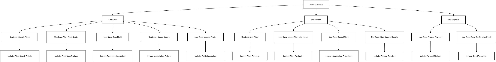

# requirement-analysis

# Requirement Analysis in Software Development.

# What is Requirement Analysis?
Requirement Analysis is the first and most critical phase of the Software Development Life Cycle (SDLC). It’s all about understanding what a software system needs to do—before a single line of code is written.

# Why is Requirement Analysis Important?

Requirement Analysis is the unsung hero of successful software development—it’s where clarity begins and chaos is prevented. Here’s why it’s so important:
🚀 Sets the Foundation for Development
- It defines what the system should do and how it should behave, giving developers a clear roadmap.
- Without it, teams risk building something that doesn’t meet user or business needs.
🛡️ Minimizes Risks and Errors
- Early identification of inconsistencies, ambiguities, or unrealistic expectations helps avoid costly rework later.
- It reduces the chances of scope creep and miscommunication between stakeholders.
📈 Improves Project Efficiency
- Well-documented requirements streamline design, coding, and testing phases.
- Teams can allocate resources more effectively and set realistic timelines.
🎯 Aligns Stakeholders
- Ensures that developers, clients, and users share a common understanding of the project goals.
- Acceptance criteria derived from requirements help validate the final product.
💡 Enables Better Decision-Making
- Helps prioritize features based on business value and technical feasibility.
- Supports informed trade-offs when constraints arise.

# 🔧 Key Activities in Requirement Analysis

- **Elicitation**: Gather insights from stakeholders through interviews, surveys, or workshops.
- **Analysis**: Evaluate requirements for clarity, feasibility, and completeness.
- **Modeling**: Use diagrams to visualize system behavior and interactions.
- **Specification**: Document functional and non-functional requirements clearly.
- **Validation**: Confirm requirements align with business goals and are testable.
- **Review**: Refine and update documentation based on feedback.

## 🧱 Types of Requirements

### ⚙️ Functional Requirements
Functional requirements define **what the system should do**—the specific features and behaviors users interact with.

#### Examples for the Booking Management System:
- **User Registration & Authentication**: Allow customers and hotel managers to create accounts and log in securely.
- **Hotel Listings**: Display available hotels with details like location, amenities, and pricing.
- **Search & Booking**: Enable users to search for hotels and make reservations.
- **Payment Integration**: Process transactions via third-party gateways (e.g., credit cards, online wallets).
- **Booking Management**: Let users view, modify, or cancel bookings.
- **Notifications**: Send alerts for booking confirmations, cancellations, and promotional offers.

### 🛠️ Non-functional Requirements
Non-functional requirements define **how the system performs**—its quality attributes and constraints.

#### Examples for the Booking Management System:
- **Performance**: APIs should respond within 2 seconds under normal load.
- **Scalability**: System must handle high traffic using microservices and load balancers.
- **Availability**: Ensure 99.9% uptime with distributed server clusters.
- **Security**: Encrypt sensitive data and comply with PCI-DSS for payment processing.
- **Reliability**: Use master-slave DB architecture and caching (Redis) to ensure consistent data access.
- **Maintainability**: Modular design allows easy updates to individual services.
- **Data Archival**: Use Cassandra for long-term storage of historical booking data.

## 🧾 Use Case Diagrams

Use Case Diagrams are a visual tool used in **Requirement Analysis** to represent how different users (actors) interact with a system. They help identify system functionality from the user's perspective and clarify the scope of the system.

### 🎯 Benefits
- Provide a high-level overview of system behavior.
- Help stakeholders understand user interactions.
- Clarify system boundaries and responsibilities.
- Support communication between technical and non-technical teams.

### 👥 Actors
- **Customer**: Searches hotels, makes bookings, views booking history.
- **Hotel Manager**: Manages hotel listings, updates availability.
- **Payment Gateway**: Processes payments securely.
- **Notification System**: Sends booking confirmations and alerts.

### 📌 Use Cases
- Search Hotels
- View Hotel Details
- Make Booking
- Cancel Booking
- Manage Listings
- Update Availability
- Process Payment
- Send Notifications

### 🖼️ Diagram

https://drive.google.com/file/d/1roZJOFzX4H-RGjUe4BOc1zIZmQvHEV2E/view?usp=sharing

> The diagram above was created using Draw.io and exported as `alx-booking-uc.png`. It illustrates the interactions between system actors and core functionalities of the booking management system.

## ✅ Acceptance Criteria

Acceptance Criteria are the conditions that a feature or user story must meet to be considered complete. They serve as a shared understanding between developers, testers, and stakeholders, ensuring that the delivered functionality aligns with expectations.

### 🔍 Why They Matter
- **Clarify Expectations**: Everyone knows what “done” looks like.
- **Enable Testing**: Criteria are testable, making QA more efficient.
- **Prevent Scope Creep**: Keeps development focused and aligned.
- **Improve Communication**: Bridges the gap between technical and non-technical teams.

### 🛒 Example: Checkout Feature

**User Story**:  
_As a customer, I want to securely complete my hotel booking and make payment so that I can confirm my reservation._

**Acceptance Criteria**:
- The user must be able to review booking details before checkout.
- The system must validate payment information before processing.
- Payment must be processed via a secure third-party gateway.
- Upon successful payment, a confirmation message and booking reference must be displayed.
- A confirmation email must be sent to the user within 1 minute of successful checkout.
- If payment fails, the user must be notified and given the option to retry or cancel.

> These criteria ensure the Checkout feature is functional, secure, and user-friendly—meeting both business goals and user expectations.

## 📘 Project Overview
The Requirement Analysis Project simulates a real-world development scenario to help learners master the foundational phase of software development: requirement analysis. Through a series of structured tasks, participants will analyze, document, and visualize requirements for a **Booking Management System**, laying the groundwork for successful implementation.

## 🎯 Learning Objectives
This project equips developers with skills to:
- Understand and apply methodologies of Requirement Analysis in the Software Development Lifecycle (SDLC).
- Translate business needs into clear, structured documentation.
- Identify and classify functional vs. non-functional requirements for scalable systems.
- Use tools like **Draw.io** to create visual representations of system interactions.
- Define precise acceptance criteria aligned with user and business goals.
- Produce industry-standard documentation and diagrams.

## ✅ Requirements
To complete this project, learners should:
- Have a GitHub account and understand repository basics.
- Be proficient in writing markdown (`README.md` files).
- Understand SDLC phases and the significance of requirement analysis.
- Know how to use **Draw.io** (or similar tools) for diagramming.
- Be able to articulate use cases, system requirements, and acceptance criteria.
- Reference the provided case study for context.

## ✨ Key Highlights
- **Real-world Simulation**: Experience practical requirement analysis tasks.
- **Comprehensive Documentation**: Learn to write detailed requirement specifications.
- **Visual Design**: Use diagrams to illustrate system actors and interactions.
- **Acceptance Criteria**: Define success parameters to guide development.
- **Step-by-Step Learning**: Build knowledge incrementally through tasks.
- **Professional Standards**: Follow best practices for real client-ready documentation.

